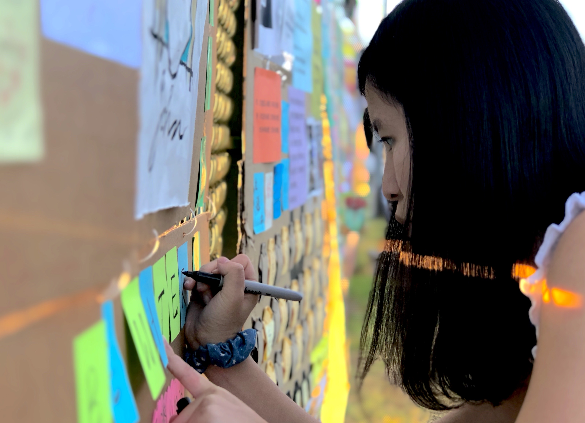

I was born and raised in Hong Kong and became a Canadian citizen when I became an adult. My native language is Cantonese, and I also speak English, Mandarin, and know a little bit of Japanese. I have never thought of leaving Hong Kong, until the Umbrella movement in 2014, during when I was a second-year student at the Chinese University of Hong Kong. Advised by our respectable mentors, my partner, [Kennedy Chi-pan Wong](https://kennedysociology.wixsite.com/home), and I decided to continue our undergraduate studies at the University of British Columbia (UBC). 

I began my journey in Quantitative Psychology in the third year of my undergraduate studies, at the [UBC SEM LAB](https://ubcsemlab.com/) under the guidance of Dr. Victoria Savalei and Dr. Xijuan (Cathy) Zhang. I am very grateful to both Vika and Cathy, who sparked my interest in quantitative methods for psychological and behavioral research and provided immense support and training to me. 

I am now pursuing a Ph.D. degree under the supervision of Dr. [Hok Chio (Mark) Lai](https://quantscience.rbind.io/) at the [USC MMM Lab](https://mmmlab.rbind.io/). Mark has excellent insights to quantitative problems, and he has greatly been inspiring my research. He gives me plenteous opportunities to develop my research expertise, gain experiences in teaching and mentoring, and collaborate with researchers in other disciplines. I am beyond thankful for his mentorship. 

I personally like dystopian stories, perhaps because in them I often find condolences. When I was writing this paragraph, Hong Kong, our hometown, has flipped another page of its dystopian story. As writing about them---the stories, the history---may break the [National Security Law](https://en.wikipedia.org/wiki/Hong_Kong_national_security_law), please forgive me for refraining from unveiling them here. It's getting harder and harder to tell the truths, our stories, our experiences. And it's even more difficult to have people listen and believe in them. If you ever have a chance, I would sincerely appreciate your time and patience to learn about the dystopian story of our lovely hometown. While years have been challenging to Hong Kong, as well as to the world due to Covid, let's not lose hope and continue to stand for the values we believe in. 

Be WaTer, my friends. 

  

